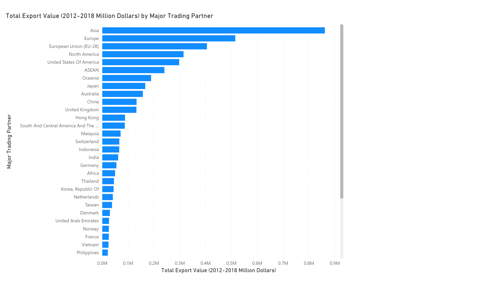
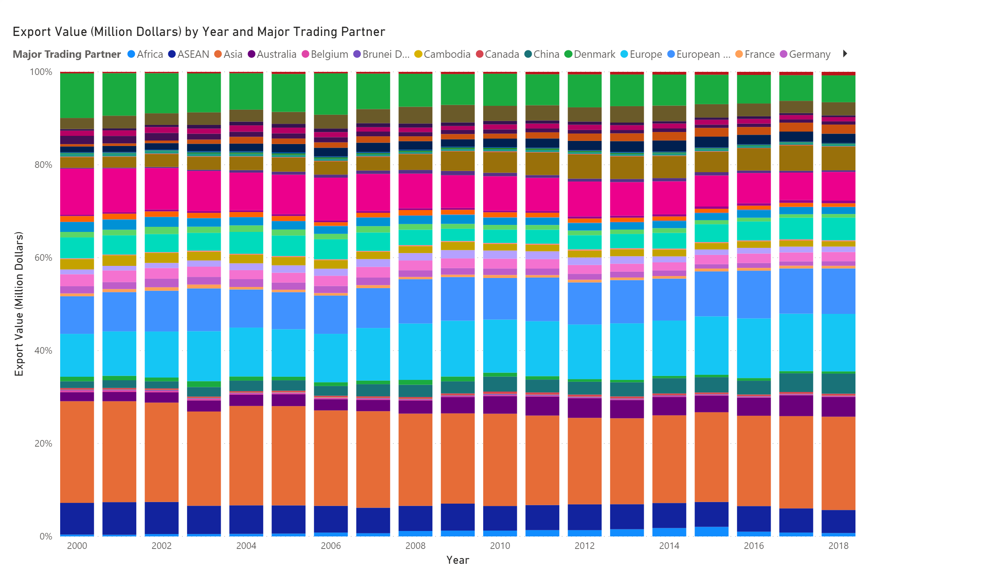
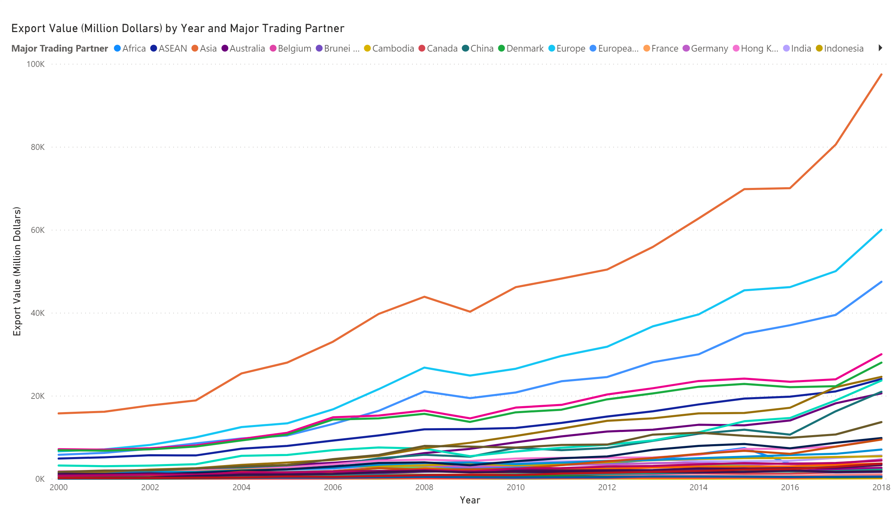

_April 2, 2020_

##### **Student Name:** Lai Liwen
##### **Matriculation Number:** A0162537A
##### **Link (report page):** [https://livian1107.github.io/CS5346/export/export.html](https://livian1107.github.io/CS5346/export/export.html)
##### **Link (PowerBI: interactive charts report, 3 pages for 3 charts):** [https://bit.ly/2R8CFNU](https://bit.ly/2R8CFNU)

This dataset contains exports of services value of cross-borader services provided by residents to non-residents. The data are compiled solely from the international trade in services survey managed by Ministry of Trade and Industry - Department of Statistics. From this dataset, we could discover the tading relation status of Singapore with its major trading partners.
[Dataset](https://data.gov.sg/dataset/exports-of-services-by-major-trading-partner-annual)

## Total Export Value By Major Trading Partner
This bar chart shows the total export services value of each country from year 2012-2018 in descending order. We can see that the major export trading were with Asia countries.

##### Data used in this bar chart

| Data         | Data Type     | Encoding  | Note                                                 |
|:-------------|:--------------|:----------|:-----------------------------------------------------|
| Export Value  | Quantitative  | Length | The length of the bar shows the export services value |
| Country   | Categorical | Position    | Each country is on its own row (sorted by export value) |

## Death Rate and Recover Rate by Country
This 100% stacked column chart shows distribution of export services value by partners for each year. It is clearly shown that Asia and Europe are taken a huge part in the export services and remain stable from 2012-2018.

##### Data used in this 100% stacked column chart

| Data         | Data Type     | Encoding  | Note                                                 |
|:-------------|:--------------|:----------|:-----------------------------------------------------|
| Export Value  | Quantitative  | Length | The length of the bar shows the related export value |
| Year | Ordinal | Position | The x-axis shows each year |
| Country   | Categorical | Color  | Each country has its own color |

## Export Value by Year and Major Trading Partner
This line chart shows the growth of export services value of each country from 2012-2018. We can see the clear increasing trend over all major trading partner, while Asia and Afirca have take up a great part and hold high growth rate.

##### Data used in this line chart

| Data         | Data Type     | Encoding  | Note                                                 |
|:-------------|:--------------|:----------|:-----------------------------------------------------|
| Year         | Ordinal       | Position  | The x-axis shows each date                        |
| Export Value  | Quantitative  | Position | The y-axis represents the export value |
| Country   | Categorical | Hue    | The different colors represent different countries |

[back](./)

